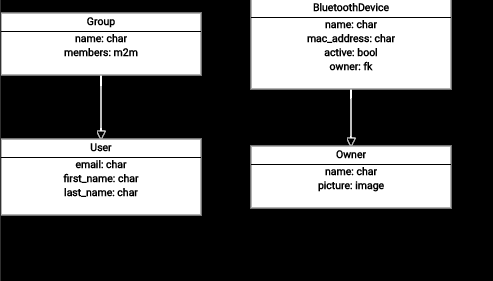
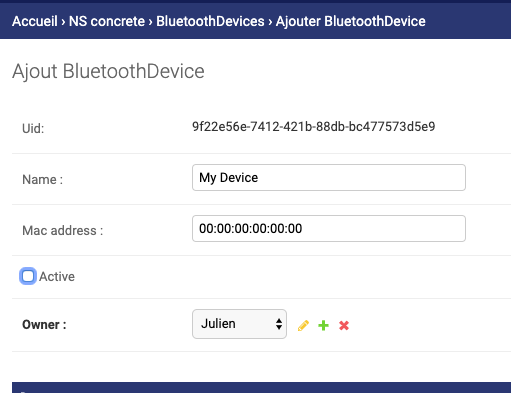
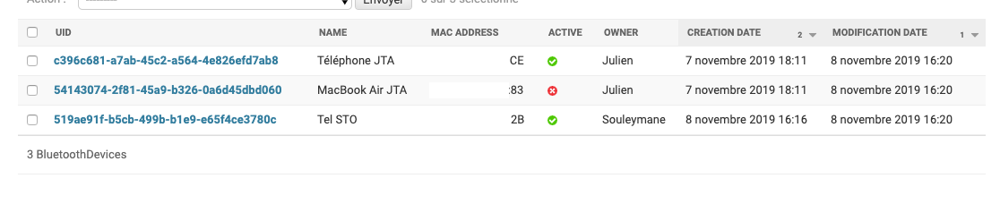

# Bluetooth brother is Watching you

## Les objects connectés

Aujourd'hui, les objets connectés sont omniprésents dans le quotidien gens: Téléphone, ordinateurs, écouteurs sans fils, télévisions, claviers, ...

La plupart de ces objets utilisent une technologie commune afin de communiquer: Le Bluetooth.

Le Bluetooth permet à deux appareils d'échanger des données. L'un des usages les plus communs est l'utilisation de bluetooth avec des dispositifs audio, afin d'écouter de la musique en s'affranchissant de toute connexion filiaire.

Les usages de ces objets connectés peuvent être détournés, par exemple à des fins de surveillance. 

En effet, chaque appareil bluetooth émettent régulièrement un signal afin de signaler leur présence. Grâce à ce signal, on peut connaître l'adresse MAC de l'appareil bluetooth. Cette adresse MAC est théoriquement unique.

## Le context

Ici l'idée est de détecter l'ensemble des périphériques bluetooth à proximité, afin de déterminer la présence ou non de certains appareils précis, par exemple les téléphones des employés d'une entreprise.

Grâce à ces informations, on pourrait déterminer la présence d'une personne, à condition que son téléphone ait le bluetooth activé, dans les locaux d'une entreprise, si elle est seule ou avec des collègues, dans quelle pièce, etc...

Je vais dans les lignes qui suivent, vous expliquer comment, en moins d'une heure, mettre en place un tel dispositif de détection.

### matériel nécessaire
- un raspberry pi avec interface bluetooth
- un téléphone (ou tout autre dispositif avec un interface Bluetooth activé)

### Setup

- installer Pybluez  (permet d'importer le module bluetooth)
- récupérer les adresses MAC Bluetooth des différents appareils que vous souhaitez suivre

### Le code

```python
import bluetooth

KNOWN_DEVICES = {
    "XX:XX:XX:XX:XX:83": ("Julien", "MacBook JTA")  # Adresses MAC Bluetooth
}


def who_is_here():
    nearby_devices = bluetooth.discover_devices()
    for bdaddr in nearby_devices: 
        if bdaddr in KNOWN_DEVICES.keys():
            user, device = KNOWN_DEVICES[bdaddr]
            msg = "{user} might be here, found {device}".format(user=user, device=device)
            print(msg)

if __name__ == '__main__':
    who_is_here()
```

### Avec Concrete-Server

#### Modélisation



```yml
manifest:
  version: 1.0.0
  attributes: []
  data_modeling:
    roles: []
    models:
      - fields:
          - attributes: {}
            datatype: char
            name: email
          - attributes: {}
            datatype: char
            name: first_name
          - attributes: {}
            datatype: char
            name: last_name
        name: User
        uid: f655df94-d0e1-4940-99b2-2b223949934f
        description: null
        representation_field: email
        is_default_public: false
      - fields:
          - attributes: {}
            datatype: char
            name: name
          - attributes:
              to:
                uid: f655df94-d0e1-4940-99b2-2b223949934f
                name: User
              reverse: concrete_groups
            datatype: m2m
            name: members
        name: Group
        uid: e08b1c21-9c0a-4c56-9dd8-3fec84088099
        description: null
        representation_field: name
        is_default_public: false
      - fields:
          - attributes: {}
            datatype: char
            name: name
          - attributes:
              allow_empty: true
            datatype: image
            name: picture
        name: Owner
        uid: 4f7984ff-24e2-45d6-a4a9-2e72d58359cb
        representation_field: name
        is_default_public: false
      - fields:
          - attributes: {}
            datatype: char
            name: name
          - attributes: {}
            datatype: char
            name: mac_address
          - attributes:
              default: false
            datatype: bool
            name: active
          - attributes:
              reverse: bluetooth_devices
              to:
                uid: 4f7984ff-24e2-45d6-a4a9-2e72d58359cb
                name: Owner
            datatype: fk
            name: owner
        name: BluetoothDevice
        uid: 0292f05a-bd73-450f-9d6c-36c851397e33
        representation_field: name
        is_default_public: false
    version: 1.0.0
    attributes: []
    permissions:
      - model_uid: f655df94-d0e1-4940-99b2-2b223949934f
        model_name: User
        lookups: []
        minimum_levels:
          create: manager
          delete: manager
          update: authenticated
          retrieve: authenticated
      - model_uid: e08b1c21-9c0a-4c56-9dd8-3fec84088099
        model_name: Group
        lookups: []
        minimum_levels:
          create: manager
          delete: admin
          update: manager
          retrieve: authenticated
      - model_uid: 4f7984ff-24e2-45d6-a4a9-2e72d58359cb
        model_name: Owner
        lookups: []
        minimum_levels:
          create: superuser
          retrieve: superuser
          update: superuser
          delete: superuser
      - model_uid: 0292f05a-bd73-450f-9d6c-36c851397e33
        model_name: BluetoothDevice
        lookups: []
        minimum_levels:
          create: superuser
          retrieve: superuser
          update: superuser
          delete: superuser
    application_id: ""
    resource_queries:
      - model_uid: f655df94-d0e1-4940-99b2-2b223949934f
        model_name: User
        search_fields:
          - email
        filter_fields:
          - email
        display_fields:
          - email
          - first_name
          - last_name
        export_fields: []
      - model_uid: e08b1c21-9c0a-4c56-9dd8-3fec84088099
        model_name: Group
        search_fields:
          - name
        filter_fields:
          - name
        display_fields:
          - name
        export_fields: []
      - model_uid: 4f7984ff-24e2-45d6-a4a9-2e72d58359cb
        model_name: Owner
        search_fields: []
        filter_fields: []
        display_fields: []
        export_fields: []
      - model_uid: 0292f05a-bd73-450f-9d6c-36c851397e33
        model_name: BluetoothDevice
        search_fields: []
        filter_fields: []
        display_fields: []
        export_fields: []
    one_to_many_relations:
      - source_field: owner
        source_model:
          uid: 0292f05a-bd73-450f-9d6c-36c851397e33
          name: BluetoothDevice
        target_model:
          uid: 4f7984ff-24e2-45d6-a4a9-2e72d58359cb
          name: Owner
    many_to_many_relations:
      - source_field: members
        source_model:
          uid: e08b1c21-9c0a-4c56-9dd8-3fec84088099
          name: Group
        target_model:
          uid: f655df94-d0e1-4940-99b2-2b223949934f
          name: User

```

#### Enregistrement des appareils à surveiller



#### Code

POC en moins de 50 lignes utilisant python

```python
import bluetooth
import requests
import time


class BluetoothMonitor:

    def __init__(self, api_url, token):
        self.api_url = api_url
        self.token = token

    def get_known_devices(self):
        known_devices = requests.get(
            self.api_url,
            headers={"Authorization": "token {}".format(self.token)}
        ).json().get("results", [])
        return known_devices

    def nearby_devices(self, search_time=15):
        return bluetooth.discover_devices(duration=search_time)

    def set_activity(self, device, active=False):
        requests.patch(
            url=device['url'],
            data={"active": active},
            headers={"Authorization": "token {}".format(self.token)}
        )

    def update_who_is_here(self, known_devices):
        nearby_devices = self.nearby_devices()
        for d in known_devices:
            if d['mac_address'] in nearby_devices:
                self.set_activity(d, True)
            else:
                self.set_activity(d, False)

    def run(self, sleep_time=60):
        while True:
            try:
                self.update_who_is_here(self.get_known_devices())
            except Exception:
                pass
            time.sleep(sleep_time)


if __name__ == '__main__':
    url = 'http://<domain>/api/v1.1/bluetooth-device/'
    token = '<api token>'
    monitor = BluetoothMonitor(api_url=url, token=token)
    monitor.run(sleep_time=30)
```




